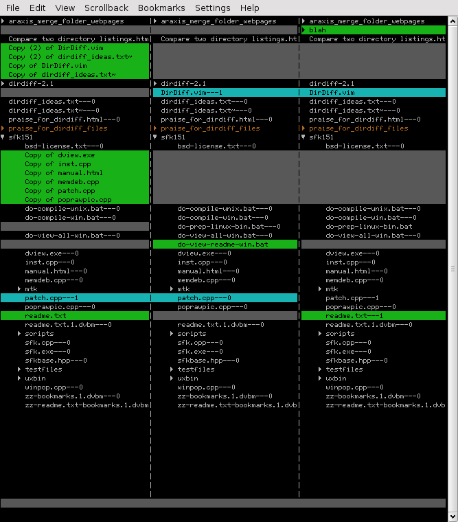

# umerge
Unix command line diff/merge tool for directories

## Motivation
I have been used to using programs like Araxis Merge and Beyond Compare for comparing and merging directories on various OSes with GUIs.  Recently I needed to work while ssh'ed into remote Linux machines and found that there were no comparable tools for the Unix command line.  Umerge was the result of scratching my itch, so to speak.

## What it does
Umerge is a command-line program to do comparisons and merges of directories for Unix operating systems.  It farms out comparisons of files to "diff" and "diff3", and graphical interactive comparisons to "ediff" and "vimdiff."

## Note
This code is the result of exploratory programming: I was trying to learn how best to use ncurses from Python and to use Python to glue Unix command line programs together to create a resulting program with the least amount of effort.  As a result, there is code duplication and obvious ineffeciencies.  This is code I use daily on a personal basis, but I don't pretend it's production-quality code at this point.

## Documentation
I'll put docs here soon.

## Issues
* No Truecolor yet

Ncurses has added Truecolor support, but the Python bindings have not yet caught up.  I will try to add support for Truecolor once this happens.

* No version control integration

At this point, umerge compares and merges directories.  A logical extension would be to integrate with version control systems like git and be able to diff two changelists.  I haven't addressed this yet, but it seems like an admirable goal.

