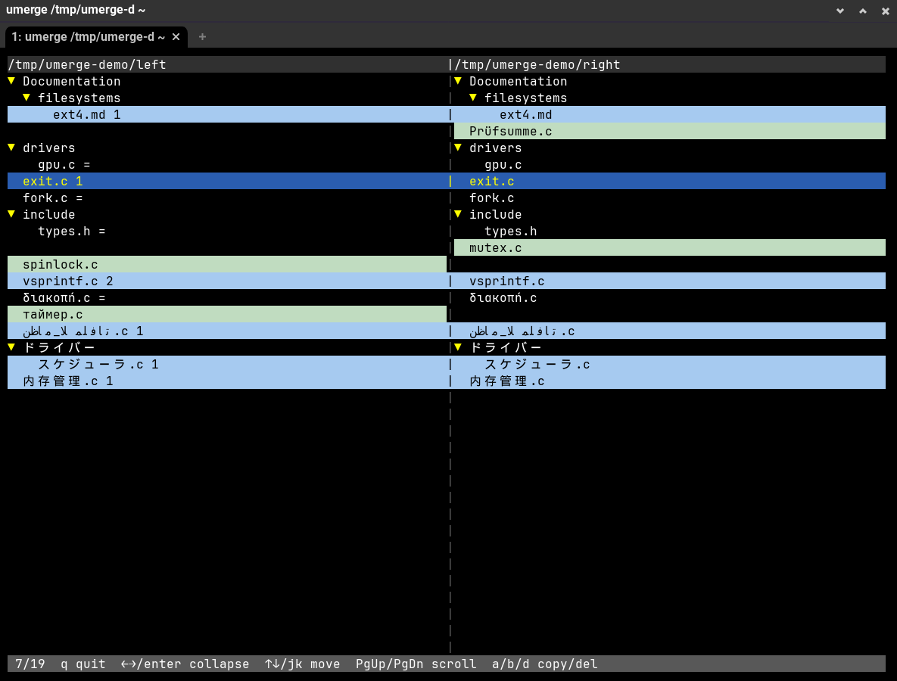
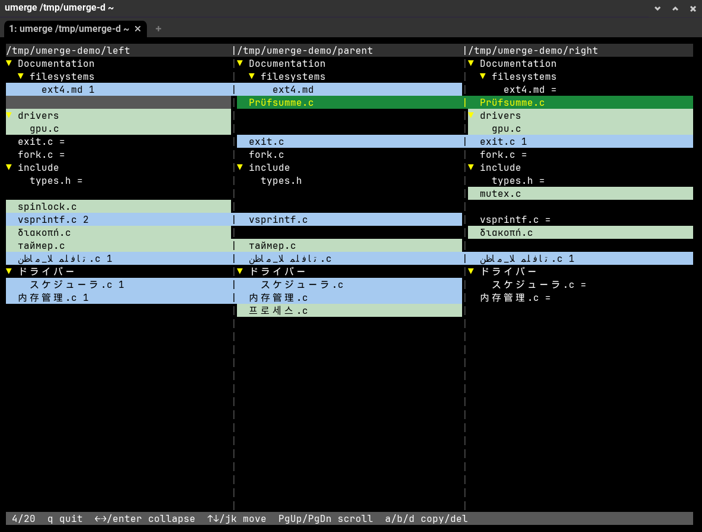

# umerge

[](https://github.com/mcjames/umerge/actions/workflows/ci.yml)

A terminal-native two-way and three-way directory diff and merge tool —
and a drop-in `git difftool -d` backend.

umerge recursively compares two directory trees (or three, with a common
ancestor in the middle) and shows them side by side in a navigable,
color-coded TUI. Spot a difference, jump straight into `vimdiff`/`ediff`
to look at it, then copy or delete files without leaving the terminal.

## Screenshots

**Two-way comparison:**



**Three-way comparison** (left / parent / right, e.g. for reviewing a merge):



## Why

Beyond Compare and Araxis Merge are excellent, but they're GUI tools —
there isn't a terminal-native equivalent for directory-level diff and
merge, the way `delta`/`difftastic` cover single-file diffs in the
terminal. umerge aims to fill that specific gap: fast, keyboard-driven,
works the same over SSH as it does locally, and plugs straight into git's
own directory-diff mechanism.

## Features

- Two-way and three-way directory tree comparison, enumerated and
  compared in the background so the UI stays responsive
- Color-coded entries: unchanged, changed, present-on-some-sides-only, and
  error states, with matching separator coloring between columns that
  share a color
- Copy files/directories between sides (`a`/`b` in two-way; a multi-step
  `a`/`b`/`c` prompt in three-way) and delete them, on whichever sides
  they exist
- Jump into `vimdiff`/`vim` or `ediff`/`emacs` to inspect or resolve a
  difference, right from the tree — and it's automatically re-compared
  when you return, in case you edited it. Re-compare any entry manually
  with `r` (also re-enumerates directories, picking up files changed
  outside umerge)
- Collapsible directories, diff-hunk counts per file, Unicode tree symbols
  (▶/▼) by default, with an ASCII fallback (`-A`/`--ascii`) for terminals
  that render the Unicode ones at the wrong width

## Installation

umerge isn't packaged anywhere yet — build it from source:

```sh
git clone https://github.com/mcjames/umerge.git
cd umerge
go build .
```

Requires `diff`, `diff3`, and whichever merge tool you configure (`vim`
by default, or `emacs`) to be on your `PATH`.

## Usage

```sh
umerge left right           # two-way
umerge left parent right    # three-way; parent is the common ancestor
```

```
Usage: umerge [OPTION]... LEFT RIGHT
       umerge [OPTION]... LEFT PARENT RIGHT

  -h, --help         display this help and exit
  -V, --version      print version and exit
  -m, --merge tool   external diff/merge tool: vim or emacs (default "vim")
  -A, --ascii        use ASCII tree symbols (>/v) instead of Unicode (▶/▼)
  -U, --unicode      use Unicode tree symbols (▶/▼) — the default
  -r, --read-only    disable copy/delete; safe for viewing only (e.g. as a git difftool)
```

Key bindings (see `umerge --help` or `man umerge` for the full list):

| Key | Action |
|-----|--------|
| `↑`/`↓`, `j`/`k` | move cursor |
| `←`/`→` | collapse/expand a directory |
| `Enter` | open the file in the configured diff/merge tool |
| `a` / `b` | copy left→right / right→left (two-way); start a copy-from prompt (three-way) |
| `c` | three-way only: start a copy-from-parent prompt |
| `d` | delete the entry on every side it exists |
| `r` | re-enumerate and re-compare the entry at the cursor, in the background |
| `q`, `Ctrl-C` | quit |

`a`/`b`/`c`/`d` are disabled (with a status-bar message explaining why) when run with `-r`/`--read-only`.

### As a `git difftool` backend

git's own directory-diff mode (`git difftool --dir-diff`) materializes two
temp trees and calls one external command with two paths — exactly
umerge's own calling convention:

```ini
[difftool "umerge"]
    cmd = umerge --read-only "$LOCAL" "$REMOTE"
[diff]
    tool = umerge
```

Then `git difftool -d` opens the whole set of changes in umerge instead of
one file at a time.

The `--read-only` is deliberate, not optional flavor: git's dir-diff mode
gives whichever side matches your actual working tree as *symlinks* back
into it (not copies), to avoid needlessly duplicating bytes already on
disk. Without `--read-only`, umerge's `d` (delete) would just unlink that
symlink — harmless, but looks like it worked when it didn't — while `a`/
`b`/`c` (copy) *would* follow the symlink and genuinely overwrite your real
working-tree file, with no visual indication that anything outside the
temporary diff session was touched. `--read-only` disables all of that,
so the git integration is a safe viewer by default.

## Roadmap

umerge is a hobby project — a Go rewrite of a Python/ncurses tool of the
same name the author has maintained for about 20 years. Development is
tracked in [`TODO.md`](TODO.md); short version:

- ✅ **Done** — automated test coverage for the pre-existing core, and
  file operations (copy/delete, in both two-way and three-way mode)
- **Next up** — filtering (`.gitignore`-aware by default, include/exclude
  rules) and fast short-circuit comparison, since those matter more than
  anything else for trusting the tool on a large, real tree
- **Planned** — deeper git/Mercurial integration docs, refresh/re-compare,
  selection and bulk operations, the full three-way merge workflow
  (`diff3`-based auto-merge, resolution tracking), emacs/ediff support,
  a `~/.umergerc.toml` config file with theming (including an
  Araxis-Merge-flavored color scheme for the launched `vimdiff`/`ediff`
  session, so the jump from umerge's own colors isn't jarring), and
  further coloring refinements
- **Longer-term** — a non-interactive/scriptable output mode, and general
  robustness work (cancelling background comparison on quit, lazy tree
  loading for very large trees)

See `TODO.md` for the full detail, reasoning, and a few bugs found (and
fixed) along the way.

## License

See [`LICENSE`](LICENSE).
