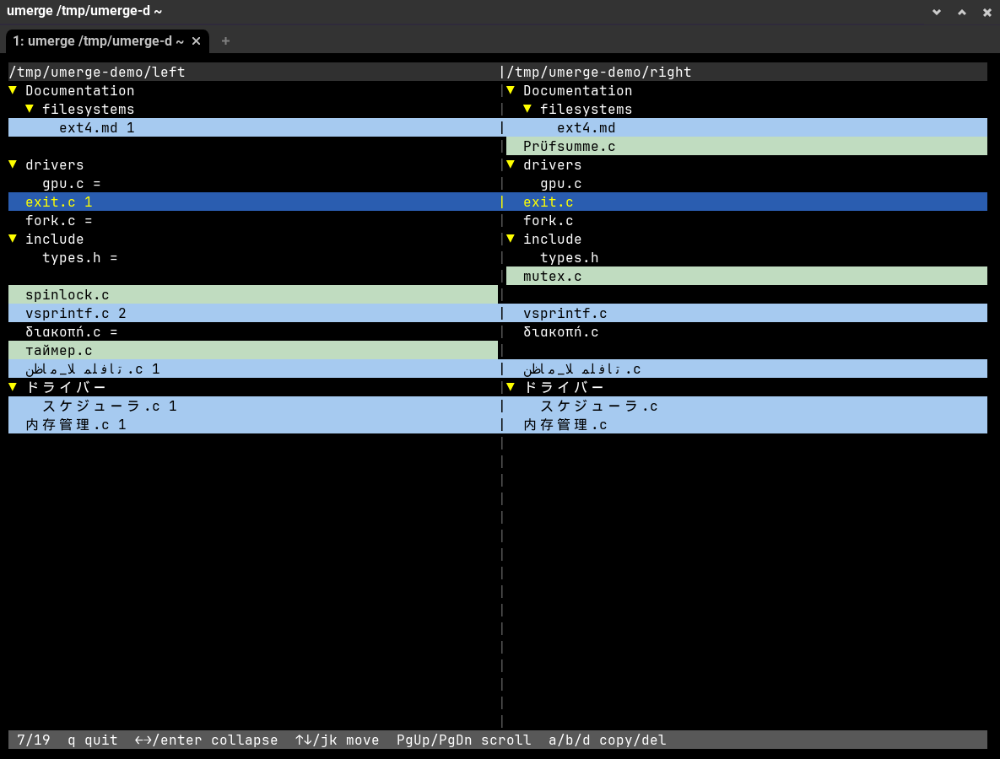
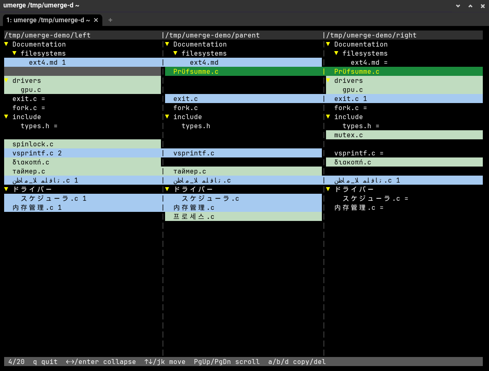

# umerge

[](https://github.com/mcjames/umerge/actions/workflows/ci.yml)
[](go.mod)
[](https://github.com/mcjames/umerge/releases)
[](LICENSE)

Unix merge tool: A terminal-native two-way and three-way directory diff and merge tool —
and a drop-in `git difftool -d` backend.

umerge recursively compares two directory trees (or three, with a common
ancestor in the middle) and shows them side by side in a navigable,
color-coded TUI. Spot a difference, jump straight into `vimdiff`/`ediff`
to look at it, then copy or delete files without leaving the terminal.

## Screenshots

**Two-way comparison:**



**Three-way comparison** (left / parent / right, e.g. for merging by hand two directories that were modified from a shared parent):



## Why

Beyond Compare and Araxis Merge are excellent, but they're GUI tools —
there isn't a terminal-native equivalent for directory-level diff and
merge, the way `delta`/`difftastic` cover single-file diffs in the
terminal. umerge aims to fill that specific gap: fast, keyboard-driven,
works the same over SSH as it does locally, and plugs straight into git's
own directory-diff mechanism.

## Features

- Two-way and three-way directory tree comparison, enumerated and
  compared in the background so the UI stays responsive
- Color-coded entries: unchanged, changed, present-on-some-sides-only, and
  error states
- Select multiple entries (`s`, propagates to a directory's subtree) and
  bulk-copy or bulk-delete the whole selection with the same `a`/`b`/`c`/`d`
  keys used for a single entry
- Three-way merge workflow: auto-merge an entry (`m`), the selection (`M`),
  or the whole tree (`n`) into the middle via `diff3 -m`, with a
  per-entry resolution-status marker (unresolved/took-a-side/
  auto-merged/manually-resolved/conflict) and `R` to mark something
  resolved by hand
- Copy files/directories between sides (`a`/`b` in two-way; a multi-step
  `a`/`b`/`c` prompt in three-way) and delete them, on whichever sides
  they exist
- Jump into `vimdiff`/`vim` or `ediff`/`emacs` to inspect or resolve a
  difference, right from the tree — and it's automatically re-compared
  when you return, in case you edited it. Re-compare any entry manually
  with `r` (also re-enumerates directories, picking up files changed
  outside umerge)
- `vimdiff`/`ediff` both open with their diff colors matching the tree's
  own palette (changed → blue, present-on-one-side → green for vim;
  ediff has no separate "present-on-one-side" face, so every difference
  gets the same blue), the same way Araxis Merge uses one consistent
  scheme across its directory and file views, instead of each editor's
  unrelated defaults
- Collapsible directories, diff-hunk counts per file, Unicode tree symbols
  (▶/▼) by default, with an ASCII fallback (`-A`/`--ascii`) for terminals
  that render the Unicode ones at the wrong width
- Focus mode (`f`): auto-collapses directories confirmed clean (no
  differences anywhere beneath them) to one dimmed line, so a huge
  comparison with only a handful of real changes doesn't drown them in
  thousands of unchanged files; `t` shows live clean/pending/differ
  counts in the status bar instead of the usual key-binding hints
- Respects a top-level `.gitignore` by default (plus always hiding `.git`
  itself), so comparing a real repo doesn't drown you in build artifacts;
  pass `-I`/`--no-gitignore` to see everything

## Installation

umerge isn't packaged in any package manager yet, but it installs cleanly
with Go's own tooling:

```sh
go install github.com/mcjames/umerge@latest
```

Or build it from source:

```sh
git clone https://github.com/mcjames/umerge.git
cd umerge
go build .
```

Requires `diff`, `diff3`, and whichever merge tool you configure (`vim`
by default, or `emacs`) to be on your `PATH`.

## Usage

```sh
umerge left right           # two-way
umerge left parent right    # three-way; parent is the common ancestor
```

```
Usage: umerge [OPTION]... LEFT RIGHT
       umerge [OPTION]... LEFT PARENT RIGHT

  -h, --help         display this help and exit
  -V, --version      print version and exit
  -m, --merge tool   external diff/merge tool: vim or emacs (default "vim")
  -A, --ascii        use ASCII tree symbols (>/v) instead of Unicode (▶/▼)
  -U, --unicode      use Unicode tree symbols (▶/▼) — the default
  -r, --read-only    disable copy/delete; safe for viewing only (e.g. as a git difftool)
  -I, --no-gitignore don't skip files/directories matched by .gitignore
```

Key bindings (see `umerge --help` or `man umerge` for the full list):

| Key | Action |
|-----|--------|
| `↑`/`↓`, `j`/`k` | move cursor |
| `←`/`→` | collapse/expand a directory |
| `Enter` | open the file in the configured diff/merge tool |
| `s` | toggle selection on the entry at the cursor (propagates to its subtree) |
| `Esc` | clear the whole selection, tree-wide |
| `a` / `b` | copy left→right / right→left (two-way); start a copy-from prompt (three-way) |
| `c` | three-way only: start a copy-from-parent prompt |
| `d` | delete the entry on every side it exists |
| `r` | re-enumerate and re-compare the entry at the cursor, in the background |
| `h` | toggle the hidden flag on the entry at the cursor (and its subtree) |
| `H` | toggle whether hidden entries are shown at all |
| `f` | toggle focus mode: auto-collapse confirmed-clean directories |
| `t` | toggle clean/pending/differ counts in the status bar |
| `m` | three-way only: auto-merge the entry at the cursor into the middle |
| `M` | three-way only: auto-merge every selected entry into the middle |
| `n` | three-way only: auto-merge the entire tree into the middle in one keystroke |
| `R` | three-way only: mark the entry at the cursor's subtree as resolved |
| `q`, `Ctrl-C` | quit |

When one or more entries are selected (`s`), `a`/`b`/`c`/`d` act on the whole
selection instead of just the entry at the cursor — the status bar shows a
`N selected` count as a reminder, since the selection is tree-wide and can be
scrolled out of view. The selection persists after a bulk copy (so you can
copy the same selection to a second destination in three-way mode without
reselecting); `Esc` clears it in one press, from anywhere in the tree, when
you're done with it. Selecting a directory whose ancestor is already
selected is blocked (flashes a message) rather than creating a partial
selection: deselect the ancestor first, then hand-pick the rest.

`a`/`b`/`c`/`d` are disabled (with a status-bar message explaining why) when run with `-r`/`--read-only`.

### Three-way merge

In three-way mode, each entry carries a one-character resolution status
next to its name, showing where it stands in the merge:

| Char | Meaning | Color |
|------|---------|-------|
| (blank) | unresolved — no action taken yet | green |
| `a` / `b` | resolved by copying left / right into the middle | green |
| `m` | auto-merged cleanly with `diff3 -m`, no overlaps | yellow |
| `r` | manually resolved (marked with `R` after fixing it by hand) | yellow |
| `c` | conflict — needs manual resolution | red |

`m` auto-merges just the entry at the cursor into the middle; `M` does the
same for every selected entry; `n` auto-merges the whole tree in one
keystroke. The classifier: an entry added on only one side is copied in
and marked `a`/`b`; one side unchanged and the other deleted is honored
silently (no marker); one side *modified* and the other deleted is left as
a conflict (`c`) rather than silently picking a side, since there's no way
to reconcile "here's an edit" with "delete this" without asking; an entry
added independently on both sides with no common ancestor auto-resolves
when the two copies are byte-identical, otherwise conflicts; and an entry
present on all three sides merges cleanly via `diff3 -m` when the changes
don't overlap, or conflicts (leaving the file untouched) when they do.
umerge never builds its own conflict-resolution UI for a `c` entry — press
`Enter` to open it in `vimdiff`/`ediff`, resolve it by hand, save, and
press `R` to mark the subtree resolved once you're satisfied (it doesn't
auto-clear on its own, even if a save happens to zero out the diff count).

`m`/`M`/`n`/`R` are disabled (with a status-bar message explaining why)
when run with `-r`/`--read-only`.

### Focus mode

On a huge tree (two Linux kernel checkouts, say) with only a handful of
real differences, wading through thousands of unchanged files to find
them defeats the point of a diff tool. `f` toggles focus mode: an
individual file confirmed identical vanishes entirely, and a directory
confirmed clean — no differences anywhere beneath it, and nothing left to
compare — collapses to a single dimmed line instead of listing its
(uninteresting) contents. This applies even to a clean file sitting right
next to a differing sibling in the same directory — the directory itself
stays expanded (it has a real difference inside), but each individual
clean file within it still disappears, leaving only what actually
differs. On a large comparison this produces a nice effect for free:
turn focus mode on early and watch the visible tree progressively narrow
down to just the files that actually differ as the background scan
completes — clean subtrees never pop back into view once collapsed, so
the tree only ever shrinks while a scan is running, never jumps around.

A subtree you've explicitly hidden with `h` stays hidden either way —
focus mode never overrides that.

`t` swaps the status bar's key-binding hints for a live summary instead:
`1,842 clean · 12 pending · 3 differ` (the `pending` segment disappears
once it hits zero). This turns on automatically the moment a comparison
starts and turns back off the moment it finishes, but you can toggle it
manually with `t` at any time in either phase.

By default, entries matched by a top-level `.gitignore` in any compared
root are skipped (along with `.git` itself, always). This only reads the
top-level `.gitignore` — nested per-directory ones aren't honored yet. Pass
`-I`/`--no-gitignore` to disable this and see everything.

### As a `git difftool` backend

git's own directory-diff mode (`git difftool --dir-diff`) materializes two
temp trees and calls one external command with two paths — exactly
umerge's own calling convention:

```ini
[difftool "umerge"]
    cmd = umerge --read-only "$LOCAL" "$REMOTE"
[diff]
    tool = umerge
```

Then `git difftool -d` opens the whole set of changes in umerge instead of
one file at a time.

The `--read-only` is deliberate, not optional flavor: git's dir-diff mode
gives whichever side matches your actual working tree as *symlinks* back
into it (not copies), to avoid needlessly duplicating bytes already on
disk. Without `--read-only`, umerge's `d` (delete) would just unlink that
symlink — harmless, but looks like it worked when it didn't — while `a`/
`b`/`c` (copy) *would* follow the symlink and genuinely overwrite your real
working-tree file, with no visual indication that anything outside the
temporary diff session was touched. `--read-only` disables all of that,
so the git integration is a safe viewer by default.

## Roadmap

Development is tracked in [`TODO.md`](TODO.md); in planned order:

- Wildcard/regex include/exclude filters, plus options to ignore
  whitespace/case/blank-line-only diffs when comparing file contents
- Nested per-directory `.gitignore` support (currently only the top-level
  file is read)
- Deeper git/Mercurial integration docs
- A `~/.umergerc.toml` config file with theming, including making the
  `vimdiff`/`ediff` color match user-overridable instead of hardcoded
- The remaining nuanced 3-way partial-presence colors
- A non-interactive/scriptable output mode
- General robustness work (cancelling background comparison on quit, lazy
  tree loading for very large trees)

See `TODO.md` for the full detail, reasoning, and a few bugs found (and
fixed) along the way.

## License

See [`LICENSE`](LICENSE).
